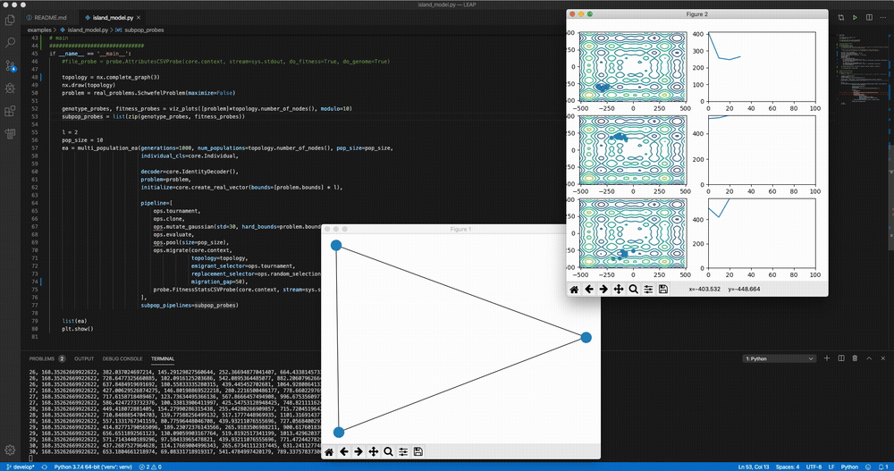
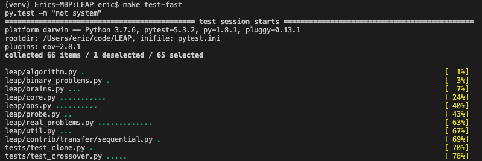

**LEAP: Evolutionary Algorithms in Python**

*Written by Dr. Jeffrey K. Bassett, Dr. Mark Coletti, and Dr. Eric Scott*

[](https://github.com/AureumChaos/LEAP/actions/workflows/pytest-standard-fast.yml)
[](https://coveralls.io/github/AureumChaos/LEAP?branch=master)
[](https://leap-gmu.readthedocs.io/en/latest/?badge=latest)

LEAP is a general purpose Evolutionary Computation package that combines 
readable and easy-to-use syntax for search and optimization algorithms with 
powerful distribution and visualization features.

LEAP's signature is its operator pipeline, which uses a simple list of 
functional operators to concisely express a metaheuristic algorithm's 
configuration as high-level code.  Adding metrics, visualization, or 
special features (like distribution, coevolution, or island migrations)
is often as simple as adding operators into the pipeline.


# Using LEAP

Get the stable version of LEAP from the Python package index with

```bash
pip install leap_ec
```

## Simple Example

The easiest way to use an evolutionary algorithm in LEAP is to use the 
`leap_ec.simple` package, which contains simple interfaces for pre-built
algorithms:

```Python
from leap_ec.simple import ea_solve

def f(x):
    """A real-valued function to optimized."""
    return sum(x)**2

ea_solve(f, bounds=[(-5.12, 5.12) for _ in range(5)], maximize=True)
```

## Genetic Algorithm Example

The next-easiest way to use LEAP is to configure a custom algorithm via one 
of the metaheuristic functions in the `leap_ec.algorithms` package.  These 
interfaces offer you a flexible way to customize the various operators, 
representations, and other components that go into a modern evolutionary 
algorithm.

Metaheuristics are usually defined by three main objects: a `Problem`, a
`Representation`, and a pipeline (list) of `Operators`.

Here's an example that applies a genetic algorithm variant to solve the 
`MaxOnes` optimization problem.  It uses bitflip mutation, uniform crossover, 
and binary tournament_selection selection:

<details>
    <summary>Python code for simple GA</summary>

```Python
from leap_ec.algorithm import generational_ea
from leap_ec import ops, decoder, probe, representation
from leap_ec.binary_rep import initializers
from leap_ec.binary_rep import problems
from leap_ec.binary_rep.ops import mutate_bitflip

pop_size = 5
final_pop = generational_ea(max_generations=10, pop_size=pop_size,

                            # Solve a MaxOnes Boolean optimization problem
                            problem=problems.MaxOnes(),

                            representation=representation.Representation(
                                # Genotype and phenotype are the same for this task
                                decoder=decoder.IdentityDecoder(),
                                # Initial genomes are random binary sequences
                                initialize=initializers.create_binary_sequence(length=10)
                            ),

                            # The operator pipeline
                            pipeline=[
                                    # Select parents via tournament_selection selection
                                    ops.tournament_selection,
                                    ops.clone,  # Copy them (just to be safe)
                                    # Basic mutation with a 1/L mutation rate
                                    mutate_bitflip(expected_num_mutations=1),
                                    # Crossover with a 40% chance of swapping each gene
                                    ops.uniform_crossover(p_swap=0.4),
                                    ops.evaluate,  # Evaluate fitness
                                    # Collect offspring into a new population
                                    ops.pool(size=pop_size),
                                    probe.BestSoFarProbe()  # Print the BSF
                                    ])
```

</details>

## Low-level Example

However, it may sometimes be necessary to have access to low-level details of
an EA implementation, in which case the programmer can arbitrarily connect
individual components of the EA workflow for maximum tailorability.   For
example:

<details>
    <summary>Low-level example python code</summary>

```python
from toolz import pipe

from leap_ec.individual import Individual
from leap_ec.decoder import IdentityDecoder
from leap_ec.context import context

import leap_ec.ops as ops
from leap_ec.binary_rep.problems import MaxOnes
from leap_ec.binary_rep.initializers import create_binary_sequence
from leap_ec.binary_rep.ops import mutate_bitflip
from leap_ec import util

# create initial rand population of 5 individuals
parents = Individual.create_population(5,
                                       initialize=create_binary_sequence(4),
                                       decoder=IdentityDecoder(),
                                       problem=MaxOnes())
# Evaluate initial population
parents = Individual.evaluate_population(parents)

# print initial, random population
util.print_population(parents, generation=0)

# generation_counter is an optional convenience for generation tracking
generation_counter = util.inc_generation(context=context)

while generation_counter.generation() < 6:
    offspring = pipe(parents,
                     ops.tournament_selection,
                     ops.clone,
                     mutate_bitflip(expected_num_mutations=1),
                     ops.uniform_crossover(p_swap=0.2),
                     ops.evaluate,
                     ops.pool(size=len(parents)))  # accumulate offspring

    parents = offspring

    generation_counter()  # increment to the next generation

    util.print_population(parents, context['leap']['generation'])
```

</details>
                                          
## More Examples

A number of LEAP demo applications are found in the the `example/` directory of the github repository:

```bash
git clone https://github.com/AureumChaos/LEAP.git
python LEAP/examples/advanced/island_models.py
```


*Demo of LEAP running a 3-population island model on a real-valued optimization problem.*


# Documentation

The stable version of LEAP's full documentation is over at [ReadTheDocs](https://leap-gmu.readthedocs.io/).

If you want to build a fresh set of docs for yourself, you can do so after running `make setup`:

```
make doc
```

This will create HTML documentation in the `docs/build/html/` directory.  It might take a while the first time,
since building the docs involves generating some plots and executing some example algorithms.


# Installing from Source

To install a source distribution of LEAP, clone the repo:

```
git clone https://github.com/AureumChaos/LEAP.git
```

And use the Makefile to install the package:

```bash
make setup
```

## Run the Test Suite

LEAP ships with a two-part `pytest` harness, divided into fast and slow tests.  You can run them with 

```bash
make test-fast
```
and 

```bash
make test-slow
```

respectively.


