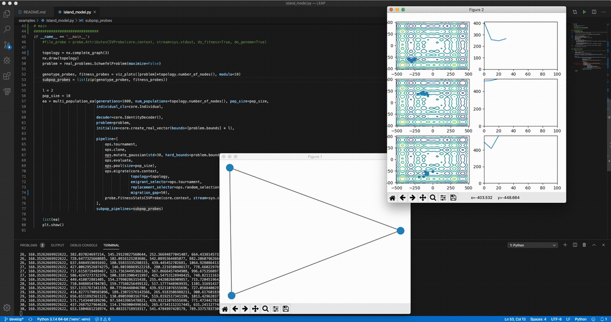

Quickstart Guide
================

**LEAP: Evolutionary Algorithms in Python**

*Written by Dr. Jeffrey K. Bassett, Dr. Mark Coletti, and Eric Scott*

 .. image:: https://travis-ci.org/AureumChaos/LEAP.svg?branch=master
    :target: https://travis-ci.org/AureumChaos/LEAP

 .. image:: https://coveralls.io/repos/github/AureumChaos/LEAP/badge.svg?branch=master
    :target: https://coveralls.io/github/AureumChaos/LEAP?branch=master

 .. image:: https://readthedocs.org/projects/leap-gmu/badge/?version=latest
    :target: https://leap-gmu.readthedocs.io/en/latest/?badge=latest

LEAP is a general purpose Evolutionary Computation package that combines
readable and easy-to-use syntax for search and optimization algorithms with
powerful distribution and visualization features.

LEAP's signature is its operator pipeline, which uses a simple list of
functional operators to concisely express a metaheuristic algorithm's
configuration as high-level code.  Adding metrics, visualization, or
special features (like distribution, coevolution, or island migrations)
is often as simple as adding operators into the pipeline.

Using LEAP
----------

Get the stable version of LEAP from the Python package index with

.. code-block:: bash

    pip install leap_ec

Simple Example
**************

The easiest way to use an evolutionary algorithm in LEAP is to use the
`leap_ec.simple` package, which contains simple interfaces for pre-built
algorithms:

.. code-block:: python

    from leap_ec.simple import ea_solve

    def f(x):
        """A real-valued function to be optimized."""
        return sum(x)**2

    ea_solve(f, bounds=[(-5.12, 5.12) for _ in range(5)], maximize=True)

Genetic Algorithm Example
*************************

The next-easiest way to use LEAP is to configure a custom algorithm via one
of the metaheuristic functions in the `leap_ec.algorithms` package.  These
interfaces off you a flexible way to customize the various operators,
representations, and other components that go into a modern evolutionary
algorithm.

Here's an example that applies a genetic algorithm variant to solve the
`MaxOnes` optimization problem.  It uses bitflip mutation, uniform crossover,
and binary tournament_selection selection:

.. code-block:: Python

    from leap_ec.algorithm import generational_ea
    from leap_ec.decoder import IdentityDecoder
    from leap_ec.representation import Representation
    from leap_ec.binary_rep.problems import MaxOnes
    from leap_ec.binary_rep.initializers import create_binary_sequence
    from leap_ec.binary_rep.ops import mutate_bitflip
    pop_size = 5
    ea = generational_ea(generations=100, pop_size=pop_size,
                        problem=MaxOnes(),             # Solve a MaxOnes Boolean optimization problem

                        representation=Representation(
                            decoder=IdentityDecoder(),             # Genotype and phenotype are the same for this task
                            initialize=create_binary_sequence(length=10)  # Initial genomes are random binary sequences
                        ),

                        # The operator pipeline
                        pipeline=[ops.tournament_selection,                     # Select parents via tournament_selection selection
                                ops.clone,                          # Copy them (just to be safe)
                                    mutate_bitflip,                 # Basic mutation: defaults to a 1/L mutation rate
                                ops.uniform_crossover(p_swap=0.4),  # Crossover with a 40% chance of swapping each gene
                                ops.evaluate,                       # Evaluate fitness
                                ops.pool(size=pop_size)             # Collect offspring into a new population
                        ])

    print('Generation, Best_Individual')
    for i, best in ea:
        print(f"{i}, {best}")

More Examples
*************

A number of LEAP demo applications are found in the the `example directory`_ of the github repository:

.. _`example directory`: https://github.com/AureumChaos/LEAP/tree/master/examples

.. code-block:: bash

    git clone https://github.com/AureumChaos/LEAP.git
    python LEAP/example/island_models.py

    Demo of LEAP running a 3-population island model on a real-valued optimization problem.

Documentation
-------------

The stable version of LEAP's full documentation is over at ReadTheDocs_

.. _ReadTheDocs: https://leap-gmu.readthedocs.io/

If you want to build a fresh set of docs for yourself, you can do so after running `make setup`:

.. code-block:: bash

    make doc

This will create HTML documentation in the `docs/build/html/` directory.  It might take a while the first time,
since building the docs involves generating some plots and executing some example algorithms.

Installing from Source
----------------------

To install a source distribution of LEAP, clone the repo:

.. code-block:: bash

    git clone https://github.com/AureumChaos/LEAP.git

And use the Makefile to install the package:

.. code-block:: bash

    make setup

Run the Test Suite
******************

LEAP ships with a two-part `pytest` harness, divided into fast and slow tests.  You can run them with

.. code-block:: bash

    make test-fast

and

.. code-block:: bash

    make test-slow

respectively.

.. figure:: _static/pytest_output.png

    Example of healthy PyTest output.

Acknowledgements
----------------

This effort used resources of the Oak Ridge Leadership Computing Facility for
developing LEAP's distributed evaluation capability, and
which is a DOE Office of Science User Facility supported under Contract
DE-AC05-00OR22725.

We would also like to thank the Department of Energy's Vehicle Technologies
Office (VTO) for their funding support.

Citing LEAP
-----------
.. ColettiEtAl2020:

BiBTeX::

    @inproceedings{10.1145/3377929.3398147,
            Address = {New York, NY, USA},
            Author = {Coletti, Mark A. and Scott, Eric O. and Bassett, Jeffrey K.},
            Booktitle = {Proceedings of the 2020 Genetic and Evolutionary Computation Conference Companion},
            Doi = {10.1145/3377929.3398147},
            Isbn = {9781450371278},
            Keywords = {evolutionary algorithm, toolkit, software},
            Location = {Canc\'{u}n, Mexico},
            Numpages = {9},
            Pages = {1571--1579},
            Publisher = {Association for Computing Machinery},
            Series = {GECCO '20},
            Title = {Library for Evolutionary Algorithms in Python (LEAP)},
            Url = {https://doi.org/10.1145/3377929.3398147},
            Year = {2020}}
